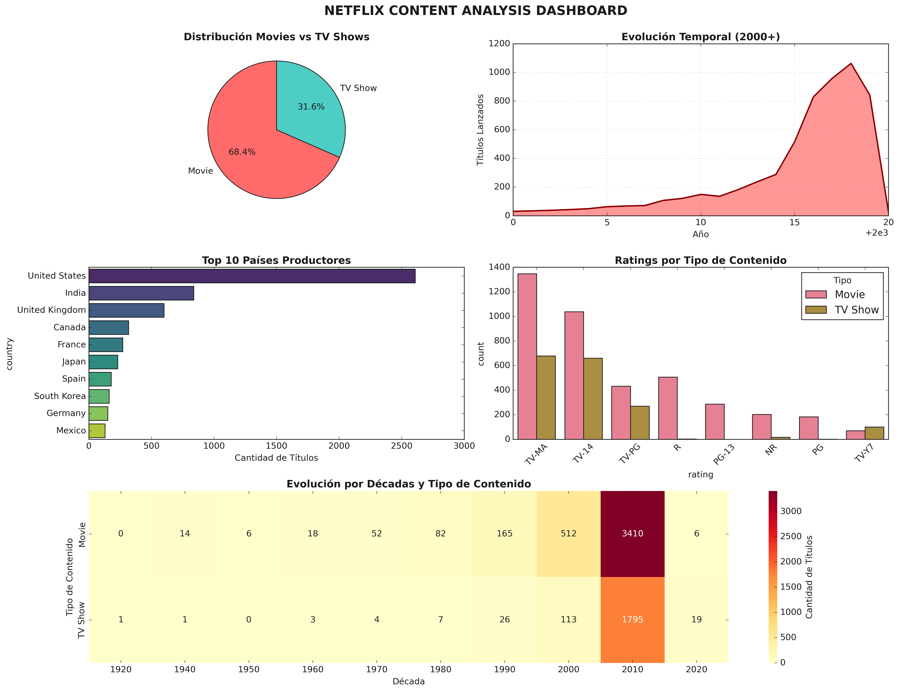

- **Autores [G1]:** Joaquín Batista, Milagros Cancela, Valentín Rodríguez, Alexia Aurrecoechea, Nahuel López  
- **Fecha:** 20/08/2025  
- **Entorno:** Python + Pandas  
- **Referencia:** [Tarea 3: EDA Netflix con Visualizaciones](https://juanfkurucz.com/ucu-id/ut1/03-eda-netflix-pandas/)

## 🎯 Objetivos

El propósito de esta práctica es realizar un **análisis exploratorio completo del dataset de Netflix** siguiendo la metodología CRISP-DM. A través de visualizaciones avanzadas y técnicas de análisis de datos, se busca:

- **Comprender el catálogo de Netflix** desde una perspectiva de negocio
- **Identificar patrones temporales** en la producción de contenido
- **Analizar distribuciones geográficas** y de géneros
- **Detectar outliers y anomalías** en los datos
- **Crear un dashboard informativo** con múltiples visualizaciones
- **Aplicar herramientas de profiling automático** para validar hallazgos

## 🎬 Contexto de Negocio (CRISP-DM)

### Problema de Negocio
Netflix necesita entender mejor su catálogo para tomar decisiones estratégicas sobre:
- **Adquisición de contenido** por región y género
- **Estrategias de producción** basadas en tendencias temporales
- **Optimización del catálogo** según preferencias de audiencia
- **Expansión geográfica** informada por datos

### Variables Clave
- **Tipo de contenido**: Movies vs TV Shows
- **Distribución geográfica**: Países de origen
- **Evolución temporal**: Años de lanzamiento y tendencias
- **Categorización**: Géneros y ratings
- **Duración**: Minutos (películas) y temporadas (series)

## 🔧 Requisitos y Dependencias

### Librerías Utilizadas
```python
import pandas as pd           # Manipulación de datos
import numpy as np            # Operaciones numéricas
import matplotlib.pyplot as plt  # Visualizaciones básicas
import seaborn as sns         # Visualizaciones estadísticas
from ydata_profiling import ProfileReport  # EDA automático
```

### Dataset
- **Fuente**: [Netflix Titles - Kaggle](https://raw.githubusercontent.com/swapnilg4u/Netflix-Data-Analysis/refs/heads/master/netflix_titles.csv)
- **Tamaño**: ~8,000+ títulos
- **Período**: Contenido desde 1920s hasta 2021+
- **Cobertura**: Global (múltiples países)

## 📊 Metodología de Análisis

### 1. **Setup y Configuración**
- Configuración de estilos visuales profesionales
- Importación y verificación de librerías
- Establecimiento de paletas de colores consistentes

### 2. **Carga y Exploración Inicial**
- Carga del dataset desde URL remota
- Inspección de estructura y tipos de datos
- Análisis de dimensiones y columnas disponibles

### 3. **Análisis de Calidad de Datos**
- **Detección de valores faltantes** por columna
- **Visualización de patrones de missing data**
- **Identificación de outliers temporales** (fechas atípicas)
- **Detección de anomalías** en datos categóricos

### 4. **Análisis Exploratorio por Dimensiones**

#### 🎭 **Análisis de Tipos de Contenido**
- Distribución Movies vs TV Shows
- Gráficos de torta y barras comparativos
- Análisis de proporciones y tendencias

#### 📅 **Análisis Temporal**
- Evolución del catálogo por décadas
- Tendencias de producción de Movies vs TV Shows
- Identificación de períodos de crecimiento

#### 🌍 **Análisis Geográfico**
- Top países productores de contenido
- Distribución geográfica por tipo de contenido
- Mapas de calor de producción por región

#### 🎨 **Análisis de Géneros y Ratings**
- Géneros más populares (expansión de listas)
- Distribución de ratings por edad
- Análisis cruzado género-rating-tipo

### 5. **Dashboard Integrado**
Creación de un dashboard completo que incluye:

- **Panel de distribuciones** principales
- **Evolución temporal** con área charts
- **Rankings geográficos** con barras horizontales
- **Análisis de ratings** con gráficos agrupados
- **Heatmap de evolución** por décadas y tipo



*Dashboard completo con análisis multidimensional del catálogo de Netflix*

## 📈 Principales Hallazgos

### Distribución de Contenido
- **68.4%** del catálogo son películas
- **31.6%** son series de TV
- Crecimiento exponencial del contenido desde 2000+

### Patrones Temporales
- **Boom de producción** en la década 2010-2020
- **Pico máximo** alrededor de 2017-2019
- **Diversificación** hacia series en años recientes

### Distribución Geográfica
- **Estados Unidos** lidera la producción (dominancia clara)
- **India** como segundo productor importante
- **Reino Unido, Canadá** en posiciones relevantes

### Análisis de Géneros
- **Dramas Internacionales** como género predominante
- **Documentales** con fuerte presencia
- **Comedias** distribuidas entre movies y shows

## 🚀 BONUS: Profiling Automático con ydata-profiling

### EDA Automático con ydata-profiling

Implementación de análisis automático usando `ydata-profiling` para:

- **Validar hallazgos manuales** con análisis estadístico automático
- **Detectar correlaciones** no evidentes
- **Generar reportes HTML** completos y navegables
- **Identificar alertas** de calidad de datos

### Configuración y Ejecución
```python
from ydata_profiling import ProfileReport

# Crear perfil completo del dataset
profile = ProfileReport(
    df, 
    title="Netflix Dataset - EDA Report",
    explorative=True,
    minimal=False
)

# Generar reporte HTML
profile.to_file("netflix_eda_report.html")
```

### 📊 Reporte Automático Generado


El reporte generado incluye:

- **Análisis estadístico completo** de todas las variables
- **Detección automática de outliers** y valores atípicos
- **Matriz de correlaciones** interactiva
- **Alertas de calidad** de datos
- **Distribuciones detalladas** por variable
- **Análisis de interacciones** entre variables

## 🎨 Visualizaciones Implementadas

### Gráficos de Distribución
- **Pie charts** para proporciones de contenido
- **Histogramas** para análisis de duración
- **Box plots** para detección de outliers

### Análisis Temporal
- **Line plots** para evolución temporal
- **Area charts** para tendencias acumulativas
- **Heatmaps** para patrones por décadas

### Análisis Geográfico
- **Bar plots horizontales** para rankings de países
- **Stacked bars** para análisis por tipo de contenido

### Análisis Categórico
- **Bubble charts** para géneros populares
- **Grouped bar plots** para ratings
- **Correlation heatmaps** para relaciones entre variables

## 📊 Estructura de Resultados

```
results/
├── visualizaciones/
│   ├── distribucion_contenido.png
│   ├── evolucion_temporal.png
│   ├── analisis_geografico.png
│   ├── generos_ratings.png
│   └── dashboard_completo.png
├── reportes/
│   ├── netflix_eda_report.html
│   └── estadisticas_principales.txt
└── datos_procesados/
    ├── netflix_clean.csv
    └── generos_expandidos.csv
```

## 🔍 Insights de Negocio

### Para Estrategia de Contenido
1. **Enfoque en series**: Crecimiento sostenido en TV Shows
2. **Mercados emergentes**: Oportunidades en India y Asia
3. **Géneros nicho**: Documentales con alta demanda

### Para Decisiones de Producción
1. **Duración óptima**: Películas entre 90-120 minutos
2. **Series cortas**: 1-3 temporadas tienen mejor adopción
3. **Contenido internacional**: Alta demanda y menor saturación

## 🤔 Reflexiones y Aprendizajes

### Metodología
- **Importancia del análisis sistemático** siguiendo CRISP-DM
- **Valor de múltiples perspectivas** (temporal, geográfica, categórica)
- **Complementariedad** entre análisis manual y automático

### Herramientas
- **pandas**: Potencia para manipulación de datos complejos
- **seaborn**: Elegancia en visualizaciones estadísticas
- **ydata-profiling**: Eficiencia en análisis exploratorio inicial

### Insights Técnicos
- **Manejo de datos faltantes** requiere estrategias específicas
- **Expansión de listas categóricas** (géneros) revela patrones ocultos
- **Detección de outliers temporales** es crucial en datasets históricos

## 🚀 Próximos Pasos

### Análisis Avanzados Propuestos
1. **Análisis de sentimientos** en descripciones
2. **Clustering de contenido** por características similares
3. **Modelos predictivos** para éxito de contenido
4. **Análisis de redes** entre actores/directores

### Herramientas a Explorar
- **Plotly**: Visualizaciones interactivas
- **Folium**: Mapas geográficos dinámicos
- **Streamlit**: Dashboards web interactivos

## 📚 Referencias

- [Dataset Netflix - Kaggle](https://raw.githubusercontent.com/swapnilg4u/Netflix-Data-Analysis/refs/heads/master/netflix_titles.csv)
- [Documentación pandas](https://pandas.pydata.org/docs/)
- [Documentación seaborn](https://seaborn.pydata.org/)
- [ydata-profiling Documentation](https://docs.profiling.ydata.ai/)
- [Tarea 3: EDA Netflix - Curso UCU](https://juanfkurucz.com/ucu-id/ut1/03-eda-netflix-pandas/)

---

## 📋 Notas de Implementación

- **Reproducibilidad**: Todo el código está documentado y es ejecutable
- **Escalabilidad**: Metodología aplicable a otros datasets de streaming
- **Profesionalismo**: Siguiendo estándares de la industria para EDA
- **Aprendizaje**: Balanceando exploración guiada con descubrimiento independiente

