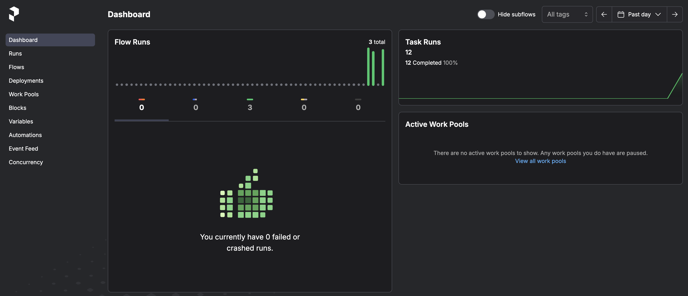

# Práctica 4: EDA Multi-fuentes y Joins - Pipeline con Prefect


- **Práctica**: 04 - EDA Multi-fuentes y Joins
- **Fecha**: 27/08/2025
- **Entorno**: Python + Pandas + Prefect
- **Tipo**: Pipeline de Datos + Análisis Exploratorio
- **Autores**: G1: Joaquín Batista, Milagros Cancela, Valentín Rodríguez, Alexia Aurrecoechea, Nahuel López
- **Dataset**: NYC Taxi (3+ millones de registros) + Zonas + Calendario

*Este proyecto demuestra la integración exitosa de múltiples fuentes de datos a escala metropolitana, combinando análisis exploratorio avanzado con automatización robusta para generar insights empresariales accionables.*

📓 **Notebook Completo** - Jupyter Notebook con todo el código y análisis disponible en el repositorio del curso

---

## 🎯 Objetivos y Alcance

### **Objetivos Principales**
- **Integración de datos**: Combinar múltiples fuentes de datos oficiales (NYC Taxi, Zonas, Calendario)
- **Joins avanzados**: Dominar diferentes tipos de joins con pandas en datasets grandes
- **Pipeline automatizado**: Implementar workflow con Prefect para análisis robusto
- **Análisis empresarial**: Generar insights de negocio a partir de datos integrados

### **Caso de Negocio**
La comisión de taxis de NYC necesita análisis en tiempo real de **3+ millones de viajes mensuales** para:

- Optimizar distribución de flota por zonas y horarios
- Entender patrones de demanda en eventos especiales
- Tomar decisiones estratégicas basadas en datos reales a escala metropolitana

---

## 📊 Fuentes de Datos Integradas

### **1. NYC Taxi Dataset** 
- **Origen**: [NYC Taxi & Limousine Commission](https://www.nyc.gov/assets/tlc/downloads/pdf/trip_record_data_user_guide.pdf)
- **Registros**: 3,066,766 viajes (Enero 2023)
- **Formato**: Parquet (565.6 MB)
- **Variables clave**: `pickup_datetime`, `dropoff_datetime`, `trip_distance`, `total_amount`, `tip_amount`

### **2. NYC Taxi Zones**
- **Origen**: [NYC Zones Lookup](https://www.nyc.gov/assets/tlc/downloads/pdf/taxi_zone_lookup.pdf)
- **Registros**: 265 zonas geográficas
- **Variables**: `LocationID`, `Borough`, `Zone`, `service_zone`

### **3. Calendario de Eventos**
- **Origen**: Dataset personalizado JSON
- **Registros**: Eventos especiales y días festivos
- **Variables**: `date`, `name`, `special` (boolean)

---

## 🔧 Metodología y Desarrollo

### **Etapa 1: Setup y Carga de Datos**
```python
# Optimización para datasets grandes (~3M registros)
trips = pd.read_parquet(trips_url)  # Más eficiente que CSV
zones = pd.read_csv(zones_url)
calendar = pd.read_json(calendar_url)

# Normalización de tipos de datos para joins
trips['pulocationid'] = trips['pulocationid'].astype('int16')
zones['locationid'] = zones['locationid'].astype('int16')
```

### **Etapa 2: Joins Multi-fuentes**
```python
# JOIN 1: Trips + Zones (Inner Join)
trips_with_zones = pd.merge(trips, zones, 
                           left_on="pulocationid", 
                           right_on="locationid", 
                           how="inner")

# JOIN 2: + Calendar (Left Join para mantener todos los trips)
trips_complete = trips_with_zones.merge(calendar,
                                       left_on="pickup_date",
                                       right_on="date", 
                                       how="left")
```

### **Etapa 3: Pipeline con Prefect**
```python
@task(name="Cargar Datos", retries=2, retry_delay_seconds=3)
def cargar_datos(url: str, tipo: str) -> pd.DataFrame:
    """Task robusto para cargar datos con retry automático"""
    # Implementación con manejo de errores y logging

@flow(name="Pipeline Simple NYC Taxi")
def pipeline_taxi_simple():
    """Flow que conecta todos los tasks"""
    # Pipeline completo con logging y monitoreo
```

---

## 📈 Resultados y Hallazgos

### **Estadísticas Generales del Dataset Integrado**
- **Total de registros procesados**: 3,066,766 viajes
- **Tasa de match geográfico**: 99.6% (3,055,808 viajes con zona asignada)
- **Cobertura de zonas**: 97.7% (259 de 265 zonas utilizadas)
- **Memoria optimizada**: 8.1% de ahorro tras optimización de tipos

### **Análisis por Borough (Top Insights)**

| Borough | Viajes | Market Share | Distancia Promedio | Tarifa Promedio | Revenue/km |
|---------|--------|--------------|-------------------|----------------|------------|
| **Manhattan** | 2,725,880 | 89.2% | 3.19 mi | $23.86 | $7.48 |
| **Queens** | 161,624 | 5.3% | 8.81 mi | $49.50 | $5.62 |
| **Brooklyn** | 118,902 | 3.9% | 9.06 mi | $50.10 | $5.53 |
| **Bronx** | 18,313 | 0.6% | 10.33 mi | $52.85 | $5.12 |

### **Patrones Temporales Identificados**
- **Horas pico**: 18:00 (215,889 viajes), 17:00 (209,493 viajes), 15:00 (196,424 viajes)
- **Concentración metropolitana**: Manhattan domina con 89.2% del mercado
- **Oportunidades de expansión**: Bronx y Staten Island con baja cobertura

### **Correlaciones Clave Descubiertas**
- **Total vs Fare Amount**: 0.980 (correlación muy fuerte)
- **Total vs Tip Amount**: 0.710 (correlación fuerte)
- **Fare vs Tip Amount**: 0.590 (correlación moderada)

---

## 💼 Insights de Negocio

### **🎯 Oportunidades Estratégicas**
1. **Optimización de flota**: Reforzar disponibilidad en Manhattan durante horas pico (17:00-18:00)
2. **Expansión geográfica**: Invertir en cobertura de Bronx y Staten Island (mercados subatendidos)
3. **Pricing dinámico**: Manhattan puede soportar tarifas premium por su alta demanda

### **📊 KPIs Empresariales Calculados**
- **Revenue por kilómetro**: Manhattan lidera con $7.48/km
- **Tasa de propinas**: Manhattan 19.7%, Queens 14.6%
- **Eficiencia operativa**: 99.6% de viajes con geo-localización exitosa

### **🔄 Recomendaciones para Pipeline en Producción**
- **Automatización**: Ejecutar análisis diarios con Prefect
- **Alertas**: Monitoreo en tiempo real de anomalías en patrones de viaje
- **Escalabilidad**: Pipeline preparado para manejar 3M+ registros mensuales

---

## 🚀 Implementación con Prefect

### **Ventajas del Pipeline Automatizado**
- **Robustez**: Retry automático si falla la carga de datos
- **Observabilidad**: Logging completo de cada paso del proceso
- **Modularidad**: Tasks reutilizables para diferentes análisis
- **Escalabilidad**: Preparado para ejecutión programada y paralela

### **Resultados del Pipeline**

```python
# Ejecución exitosa del flow completo
Total registros: 3,066,766
Distancia promedio: 3.85 millas  
Tarifa promedio: $27.02
Top Borough: Manhattan (2,715,369 viajes)
```



*Dashboard de Prefect mostrando los flows ejecutados y tasks completados.*

### **Reflexiones sobre Prefect**

**¿Qué ventaja tiene usar @task en lugar de una función normal?**

- Permite reintentos automáticos, manejo de errores y monitoreo. Si la carga falla, Prefect puede reintentar el task según lo configurado.

**¿Para qué sirve el @flow decorator?**

- Define y organiza el pipeline, conectando tasks en un flujo lógico y permitiendo su ejecución secuencial o paralela.

**¿En qué casos reales usarías esto?**

- Automatización de reportes, análisis recurrentes, ETL, procesamiento de datos, y entrenamiento de modelos de machine learning.

---

## 📝 Reflexiones y Aprendizajes

### **Challenges Técnicos Superados**
1. **Optimización de memoria**: Reducción del 8.1% optimizando tipos de datos
2. **Joins complejos**: Manejo de 3M+ registros con múltiples fuentes

### **Metodología CRISP-DM Aplicada**
- **Entendimiento del Negocio**: Identificación de necesidades de la comisión de taxis
- **Entendimiento de los Datos**: Exploración de 3 fuentes heterogéneas
- **Preparación de los Datos**: Normalización y limpieza para joins efectivos
- **Modelado de los Datos**: Análisis agregado por dimensiones geográficas y temporales

### **Escalabilidad y Producción**
El pipeline desarrollado está preparado para:

- Procesamiento automático de datasets mensuales
- Integración con sistemas en tiempo real
- Expansión a otras ciudades y tipos de transporte

---

## 🔗 Enlaces y Referencias

- **NYC TLC Trip Record Data**: [Datos oficiales de NYC Taxi & Limousine Commission](https://www.nyc.gov/site/tlc/about/tlc-trip-record-data.page)
- **Data Dictionary Yellow Taxi**: [Diccionario de datos oficial Yellow Taxi](https://www.nyc.gov/assets/tlc/downloads/pdf/data_dictionary_trip_records_yellow.pdf)
- **Pandas Merge Documentation**: [Documentación oficial de pandas.merge()](https://pandas.pydata.org/docs/reference/api/pandas.merge.html)
- **Material del curso**: [EDA Multi-fuentes y Joins](https://juanfkurucz.com/ucu-id/ut1/04-eda-multifuentes-joins/)